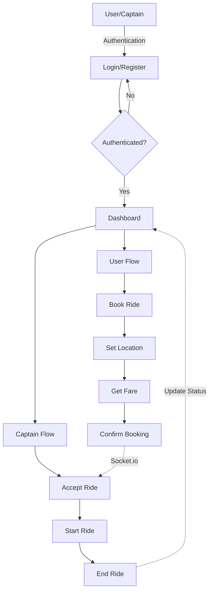

# Ride Sharing Application( Basic Uber Clone)

This project is a ride-sharing application that allows users to book rides and captains (drivers) to accept and complete rides. The application consists of a frontend built with React and a backend built with Node.js and Express. The backend uses MongoDB for data storage and Socket.io for real-time communication.

## Table of Contents

- [Features](#features)
- [Technologies Used](#technologies-used)
- [Project Structure](#project-structure)
- [Setup and Installation](#setup-and-installation)
- [API Endpoints](#api-endpoints)
- [Flowchart](#flowchart)

## Features

- User and Captain Authentication (Signup, Login, Logout)
- Real-time ride booking and updates using Socket.io
- Ride fare calculation
- Ride status updates (pending, accepted, ongoing, completed, cancelled)
- OTP verification for ride start
- User and Captain profile management
- Secure password handling with bcrypt
- JWT-based authentication
- Protected routes for authenticated users and captains

## Technologies Used

### Frontend

- React
- Vite
- Tailwind CSS
- Axios
- React Router
- Socket.io-client
- GSAP (GreenSock Animation Platform)

### Backend

- Node.js
- Express
- MongoDB
- Mongoose
- Socket.io
- JWT (JSON Web Token)
- bcrypt
- dotenv
- Express Validator

## Project Structure

```
.
├── Backend/
│   ├── .env
│   ├── app.js
│   ├── controllers/
│   ├── db/
│   ├── middleware/
│   ├── models/
│   ├── routes/
│   ├── services/
│   ├── socket.js
│   ├── package.json
│   ├── README.md
│   └── server.js
├── frontend/
│   ├── .env
│   ├── .gitignore
│   ├── eslint.config.js
│   ├── index.html
│   ├── package.json
│   ├── postcss.config.js
│   ├── public/
│   ├── src/
│   ├── tailwind.config.js
│   ├── vite.config.js
│   └── README.md
└── .gitignore
```

## Setup and Installation

### Backend

1. Navigate to the `Backend` directory:
   ```sh
   cd Backend
   ```

2. Install the dependencies:
    ```sh
    npm install
    ```

3. Create a .env file and add the following environment variables:

   ```sh
   DB_CONNECT=<your_mongodb_connection_string>
   JWT_SECRET=<your_jwt_secret>
   GOOGLE_MAPS_API=<your_google_maps_api_key>
   ```

4. Start the server:
   ```sh
   npm start
   ```

### Frontend

1. Navigate to the `frontend` directory:
   ```sh
   cd frontend
   ```

2. Install the dependencies:
    ```sh
    npm install
    ```

3. Create a .env file and add the following environment variables:

   ```sh
   VITE_BASE_URL=<your_backend_base_url>
   ```

4. Start the development server:
   ```sh
   npm run dev
   ```

## API Endpoints(refer to the backend folder readme file for more details)

### User Endpoints

- `POST /users/register` - Register a new user
- `POST /users/login` - Login a user
- `GET /users/profile` - Get user profile
- `GET /users/logout` - Logout a user

### Captain Endpoints

- `POST /captains/register` - Register a new captain
- `POST /captains/login` - Login a captain
- `GET /captains/profile` - Get captain profile
- `GET /captains/logout` - Logout a captain

### Ride Endpoints

- `POST /rides/create` - Create a new ride
- `GET /rides/get-fare` - Get fare for a ride
- `POST /rides/confirm` - Confirm a ride
- `GET /rides/start-ride` - Start a ride
- `POST /rides/end-ride` - End a ride

### Map Endpoints

- `GET /maps/get-coordinates` - Get coordinates for an address
- `GET /maps/get-distance-time` - Get distance and time between two locations
- `GET /maps/get-suggestions` - Get address suggestions for an address

## Flowchart

Below is the application flow diagram showing the interaction between different components:



## Future Improvements and Deployment Plans

- Containerize the backend using Docker and deploy to EC2 or GCP
- Set up MongoDB Atlas for production database
- Deploy frontend to Vercel or AWS S3 + CloudFront
- Add Additional Features like Payment Integration, Driver      Rating, and Notification System etc.